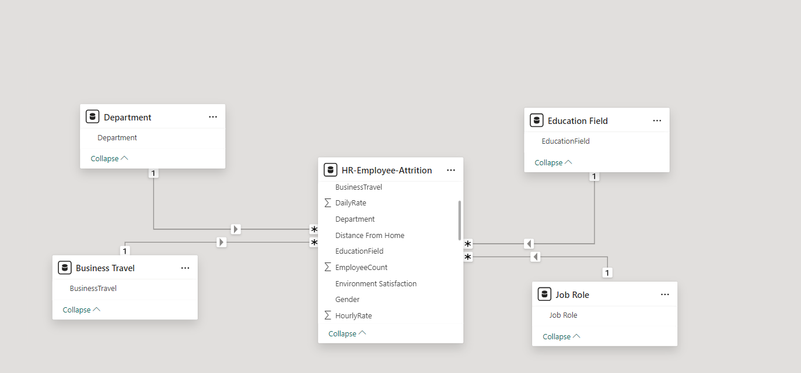
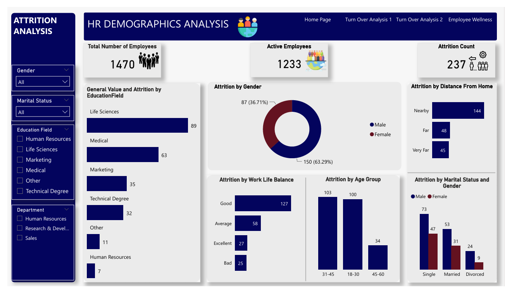
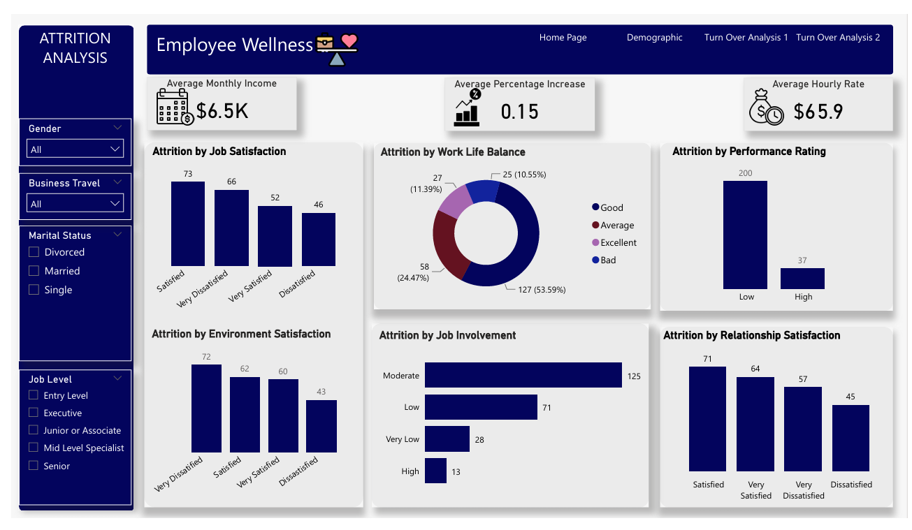

# Human Resource Attrition Analysis.

## Introduction
This is a Power BI project on employee attrition analysis of an imaginary company we'll call **Tog Groups**. The project is carried out with the aim of analyzing and deriving insights into the company's attrition rate, determining the rate, possible cause and hence, proffer data driven recommendations to the company.
**_Disclaimer_:** All datasets and reports are simply for demonstration purposes and do not represent any actual or real life company.

## Problem Statement:
1. What is the total number of employee and how many are active
2. What is the total attrition count
3. what is the attrition distribution by **Gender, Marital status, Age group and Work life balance**

## Skills/ concepts demonstrated
- Data Transformation
- DAX
- Created new dimension table from a flat table
- Data Modelling
- Filters
- Page navigation
- Data Visualization
  
## Modelling
Dataset originally came in as a flat table. I then created new dimension table in order to create a star schema model. There are 4 dimension table all joined to one fact table for a one to many relationship

## Visualization
The report comprises 4 main pages:
1. General overview
2. Turn over 1
3. Turn over 2
4. Employee wellnes
   
You can interact with the report [here](https://app.powerbi.com/view?r=eyJrIjoiN2NiYjFjYzYtNzE3Yy00ODdhLTkxNDUtODEwMzc4NDcwZjk0IiwidCI6ImFjN2I4NTA3LTcwNDMtNGJhNS1hZTY4LWU2MmYxNGU5NjBiYSJ9)

## Analysis
Overview: 
1. Tog groups had a total employee of 1470. As at the time of analysis, they only had 1,233. Meaning 237 employees had been attrited.
2. The male gender was responsible for over 63% of attried employees.
3. Those within the age group of 45-60 had the lowest attrition count.

Wellness Report:
1. While a total of 73 employees, which was the higest, claimed they were satisfied with their job, 72 of them reported to be very dissatisfied with their work environment.
2. Also, 54% of attrited employees had a good life balance. 

## Conclussion and Recomendations
The dataset provided lacked some needed records that would have made more analysis possible such as hire date and exit date.
The analysis has shown that, a major reasons employees of Tog groups have left, is because of the poor work environment. While we can specifically tell what this encompasses, it is recommended that the company set up a review committee that can improve the employee's working environment. such as providing adequate security, or even ensure the environment is beautified with flowers and light for nightime. This can go a long way in improving the work environment, and hence, reducing employee attririon in the company.
